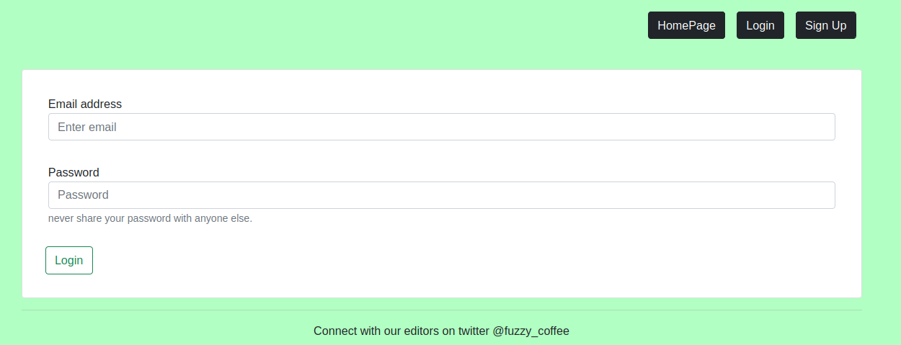
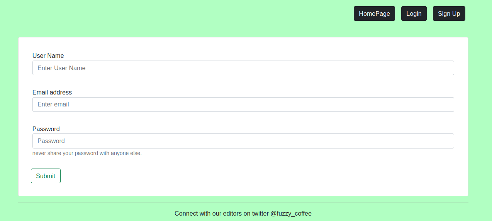
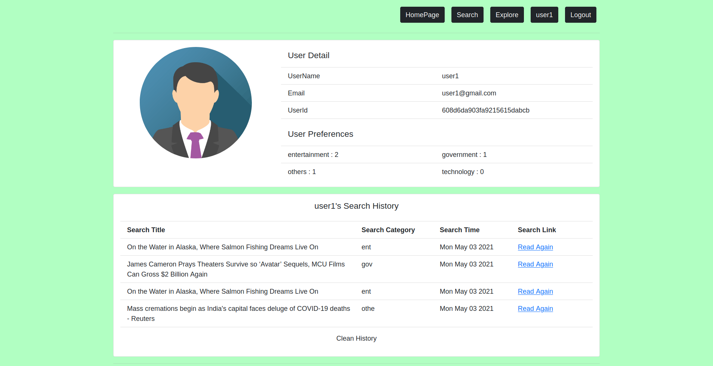
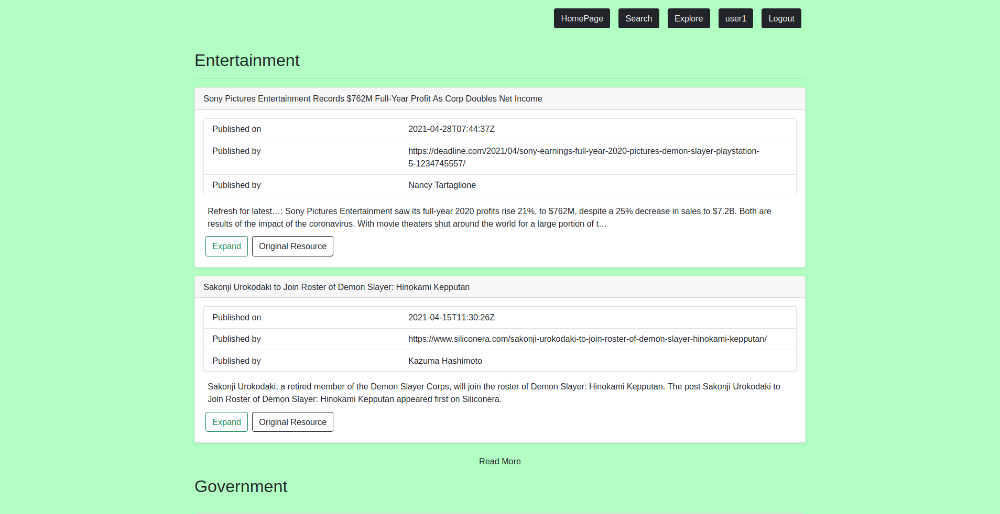
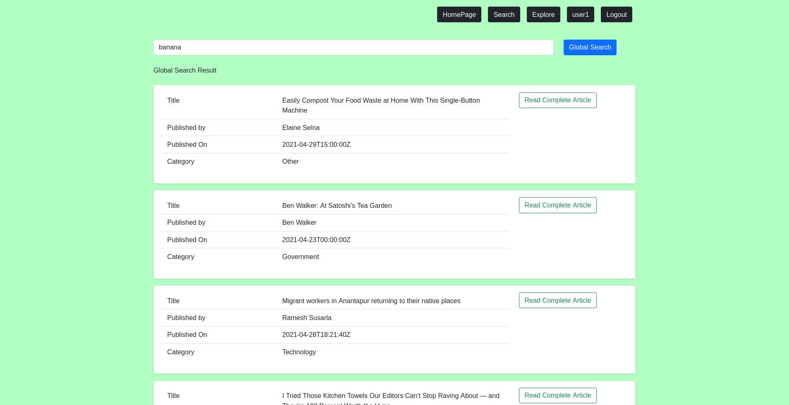

# React based github page.

## About
Morning Brew is a one stop news website serving its customers
digestable short news personalized to there taste.
As a backend service build on MERN Stack ( NodeJs, ExpressJs, MongoDB ).

This module provides the client side support using ReactJs.

## Components Of web page

###  HomePage

### Login and Registration Page

### UserPage

Each user have their own personal
details page containing users
credentials and past activities.

### ExplorePage

Explore page provides personalized
news cards for the user based on his
activity. This personalization is done
with the help of users history which is
analysed on client side making users
data in users hand and keeping it
secure.

### SearchPage

Search page allows users to get
information about the topics theydesire.

To make this search fast, a decent sized
list is cached on user login time but if
for some reason it does not not contain
the news you were looking for, the
Global search button allows your to
search it on the web and get latest news
instantly from verified source